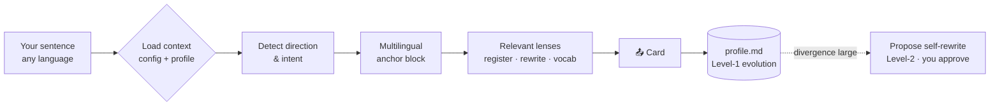

<div align="center">

# 🌐 Super Translator

### A translator that explains in **your** language, shows you **several**, and **learns you** over time.

A mother-language-anchored, multilingual, self-evolving translation & learning skill for [Claude Code](https://claude.com/claude-code) — built for non-native English speakers who want to *understand* deeply and *write* professionally.

[](LICENSE)
[](https://claude.com/claude-code)
[](#-contributing-add-your-own-lens)
[](https://github.com/JeremyJC67/super-translator/stargazers)


</div>

---

Most translators give you *a translation*. Super Translator helps you **understand**: every explanation is grounded in your mother language, the same meaning is shown across several languages so you grasp nuance by comparison, and it quietly **gets to know you** the more you use it — adapting to your weak spots and, when needed, proposing changes to its own behaviour **with your approval**.

## ✨ Why it's different

Existing tools (Nuance AI Translator, Learnables, Talkpal, Preply, Duolingo…) are strong but share three gaps:

| Gap in existing apps | 🌐 Super Translator |
|---|---|
| 📱 Closed SaaS / mobile app | Open, local, lives in your terminal & agent workflow — composable with your other skills |
| 🔒 Personalization is a black box | Your learner profile is a plain, **version-controlled file you own** |
| 🔁 Mostly L1 ↔ L2 only | **Mother-language anchor + multilingual triangulation** to expose nuance |
| 🪨 The tool never changes for you | **Two-level self-evolution**: silent profile adaptation + approval-gated, auditable self-rewrite |

## 📑 Contents

- [How it works](#-how-it-works)
- [Install](#-install)
- [Configure](#-configure)
- [Self-evolution](#-self-evolution-two-levels)
- [What's inside](#-whats-inside)
- [Contributing](#-contributing-add-your-own-lens)
- [Research notes](#-research-notes)

## 🔧 How it works



1. **Load context** — reads your `config.md` (anchor + targets) and `profile.md` (what it knows about you).
2. **Detect direction & intent** — comprehend vs produce; both directions first-class.
3. **Multilingual anchor block** — meaning grounded in your mother language, triangulated across languages.
4. **Apply only the lenses this input needs** — register, professional rewrite, key vocab & grammar.
5. **Level-1 evolution** — append what it learned about you to `profile.md`.
6. **Level-2 evolution** — when the skill itself no longer fits, it *proposes* edits you approve and commit.

<details>
<summary>📄 Example output (click to expand)</summary>

Input: `他这个人说话总是绕弯子，让人摸不着头脑。`

```
🌐 Super Translator · anchor: 中文 · intent: produce · lenses: multilingual, register, rewrite, vocab

Multilingual anchor block
  中文（原意）   他说话老是兜圈子、不直说，让人搞不懂他想表达什么。
  English (nat.) He always beats around the bush, leaving people unable to follow him.
  English (i+1)  He never says things directly, so he is hard to understand.
  Nuance   "绕弯子" → beat around the bush（地道成语）；比直译 talk in circles 更自然。

Professional Rewrite · 语域阶梯
  casual    He always talks in circles — you never know what he is getting at.
  neutral   He has a habit of beating around the bush, which makes him hard to follow.
  formal    He tends to be indirect and evasive, leaving his meaning unclear.
  回译核对  他习惯绕弯子，让人难以抓住重点 —— 与原意一致 ✓

— learning note logged to profile.md —
```
</details>

## 📦 Install

Requires [Claude Code](https://claude.com/claude-code).

```bash
git clone https://github.com/JeremyJC67/super-translator.git
cd super-translator
./install.sh          # symlinks this repo into ~/.claude/skills/super-translator
```

Then, in Claude Code:

```text
/super-translator 他这个人说话总是绕弯子，让人摸不着头脑。
```

…or just send a sentence to translate — the skill triggers automatically.

## ⚙️ Configure

Edit [`config.md`](config.md):

- **Anchor (mother language)** — default `zh`. All explanations ground here.
- **Targets** — default `en`; add a **triangulation** language anytime (e.g. `[ja]` for Japanese) to compare nuance across three languages.
- **Preferences** — adaptive depth, register ladder, back-translation check.

## 🧬 Self-evolution (two levels)

A markdown skill can't safely rewrite itself at call time — so evolution is explicit and auditable. See [`evolution.md`](evolution.md).

| Level | Trigger | What happens | Safety |
|---|---|---|---|
| **1 · Adapt to you** | Every interaction | Appends your errors / learned items / preferences to `profile.md`; output adapts next time | Additive only, plain file you own |
| **2 · Rewrite the skill** | Divergence is large | *Proposes* concrete edits to `SKILL.md` / lenses with evidence | **Approval-gated + git-versioned** |

This split — fast personal adaptation vs slow auditable structural change — is what keeps it both responsive and under your control.

## 🗂 What's inside

```
SKILL.md      orchestrator (the skill entrypoint)
config.md     your settings: anchor, targets, preferences
profile.md    self-evolving learner memory (yours, version-controlled)
evolution.md  the two-level self-evolution protocol
lenses/       composable understanding modules — extensible
  multilingual.md   anchor + multilingual triangulation (always on)
  register.md       formality / tone / connotation
  rewrite.md        professional rewrite + register ladder
  grammar-vocab.md  key vocab, collocations, grammar
docs/         research landscape & design notes
demo/         the demo GIF + its vhs script
```

## 🧩 Contributing: add your own lens

A **lens** is one focused understanding module. Adding one is the easiest way to extend Super Translator:

1. Create `lenses/your-lens.md` describing *what to produce* and *when to apply it* (copy an existing lens as a template).
2. Reference it from `SKILL.md` step 3.
3. Open a PR. Issues and ideas welcome.

To regenerate the demo GIF after changes: `vhs demo/demo.tape` (needs [vhs](https://github.com/charmbracelet/vhs)).

## 🔬 Research notes

This is a personal tool first — and a candidate testbed for *self-evolving, measurable skills* second. The honest competitive scan and the "is there a paper here?" analysis live in [`docs/research-landscape.md`](docs/research-landscape.md).

## 📜 License

MIT — see [LICENSE](LICENSE).
